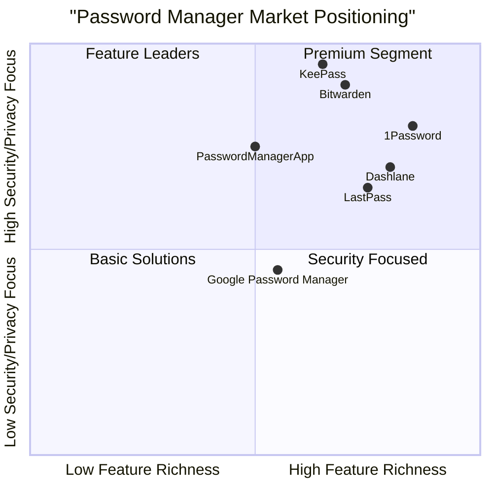

# Password Manager App - Product Requirements Document

## 1. Executive Summary

The PasswordManagerApp is an Android-based password management solution designed to help users securely store, manage, and access their passwords and credit card information. The application provides an encrypted storage system for sensitive credentials, supporting both password entries and credit card details with proper categorization and search capabilities.

The application serves as a digital vault that allows users to:
- Store website credentials (URLs, usernames, passwords)
- Manage credit card information securely
- Categorize entries for easier management
- Search through stored entries
- Generate secure passwords

Recently, the application has undergone bug fixes to resolve critical issues related to crashes when editing card details and password entries, improving overall stability.

## 2. Product Definition

### 2.1 Product Goals

1. **Security First**: Provide a highly secure, encrypted storage solution for sensitive user credentials, implementing industry-standard security protocols.
2. **User Experience**: Deliver an intuitive and streamlined user experience for managing various types of credentials with minimal friction.
3. **Comprehensive Management**: Support various credential types and provide robust organization, search, and retrieval capabilities.

### 2.2 User Stories

1. **As a** user with multiple online accounts,  
   **I want to** store my various passwords securely in one place,  
   **so that** I can access them quickly without memorizing them all.

2. **As a** frequent online shopper,  
   **I want to** securely store my credit card details,  
   **so that** I don't have to enter them manually for every purchase.

3. **As a** security-conscious individual,  
   **I want to** generate strong, unique passwords for my accounts,  
   **so that** I can maintain high security standards across all my services.

4. **As a** busy professional,  
   **I want to** quickly find credentials for specific services or websites,  
   **so that** I can efficiently access my accounts without wasting time.

5. **As a** user with sensitive information,  
   **I want to** ensure my data is encrypted and protected,  
   **so that** even if my device is compromised, my passwords remain secure.

### 2.3 Competitive Analysis

#### 1. LastPass
- **Pros**: 
  - Cross-platform availability
  - Strong encryption
  - Password sharing features
  - Two-factor authentication
- **Cons**:
  - Free tier limitations
  - Security breach history
  - Subscription cost for premium features

#### 2. 1Password
- **Pros**:
  - Excellent UI/UX
  - Strong security architecture
  - Travel Mode feature
  - Family sharing options
- **Cons**:
  - No free tier
  - Higher price point
  - Requires subscription

#### 3. Bitwarden
- **Pros**:
  - Open-source
  - Free tier is feature-rich
  - Self-hosting option
  - Cross-platform support
- **Cons**:
  - UI not as polished as competitors
  - Slower auto-fill in some browsers
  - Premium features limited compared to competitors

#### 4. KeePass
- **Pros**:
  - Completely free and open-source
  - No cloud dependency
  - Highly customizable
  - Strong encryption
- **Cons**:
  - Steep learning curve
  - Less user-friendly interface
  - Manual syncing across devices

#### 5. Dashlane
- **Pros**:
  - Intuitive interface
  - Dark web monitoring
  - VPN included in premium plans
  - Strong password generation
- **Cons**:
  - Higher cost
  - Limited free tier
  - Sometimes slower performance

#### 6. Google Password Manager
- **Pros**:
  - Free
  - Integrated with Google ecosystem
  - Cross-device sync
  - Simple to use
- **Cons**:
  - Limited features
  - Tied to Google account
  - No dedicated app interface

#### 7. PasswordManagerApp (Our Target Product)
- **Pros**:
  - Android-focused optimization
  - Offline capability
  - Simple, clean interface
  - Dedicated credit card management
- **Cons**:
  - Platform limitation (Android only)
  - Fewer advanced features
  - No cloud sync (currently)
  - Recent stability issues

### 2.4 Competitive Quadrant Chart

## 3. Technical Specifications

### 3.1 Requirements Analysis

The PasswordManagerApp must provide secure credential management capabilities on Android devices. Based on the repository analysis, the application is built with:

- **Language**: Kotlin for Android
- **Architecture**: MVVM (Model-View-ViewModel) pattern
- **Database**: Room persistence library for local storage
- **Security**: Encryption for stored credentials
- **UI Components**: Fragments for different views and functionality

The application currently supports:
- User authentication (login/registration)
- Password entry management (add, view, edit, delete)
- Credit card information management (add, view, edit, delete)
- Category management for organization
- Search functionality
- Password generation

Recently fixed issues include crashes when editing card details and password entries, which were related to Parcelable implementation and Android API compatibility.

### 3.2 Requirements Pool

#### P0 (Must Have)
1. **Secure Authentication**: Application must have secure login mechanism to protect stored data
2. **Password Storage**: Users must be able to store website credentials (URL, username, password)
3. **Credit Card Storage**: Users must be able to store credit card information securely
4. **Data Encryption**: All stored credentials must be encrypted at rest
5. **Add/Edit/Delete Operations**: Basic CRUD operations for all entry types
6. **Stable Operation**: Application must not crash during normal usage scenarios
7. **Password Generation**: Ability to generate secure passwords
8. **Search Functionality**: Quick search through stored entries
9. **Categorization**: Ability to categorize entries

#### P1 (Should Have)
1. **Auto-lock**: Application should automatically lock after a period of inactivity
2. **Copy to Clipboard**: Quick copy function for usernames and passwords
3. **Password Strength Indicator**: Visual indication of password strength
4. **Backup/Export**: Ability to backup or export encrypted database
5. **Biometric Authentication**: Support for fingerprint or face recognition login
6. **Dark Mode Support**: UI adaptation based on system settings
7. **Favorites**: Ability to mark frequently used entries as favorites

#### P2 (Nice to Have)
1. **Auto-fill Integration**: Integration with Android auto-fill service
2. **Cloud Sync**: Optional synchronization across devices
3. **Password History**: Track password changes over time
4. **Breach Detection**: Notification if stored credentials appear in known data breaches
5. **Screenshot Prevention**: Block screenshots when app is open
6. **Self-destruct Option**: Option to wipe data after failed login attempts
7. **Multiple Profiles**: Support for multiple user profiles

### 3.3 UI Design Draft

The application follows Material Design principles with a clean, intuitive interface:

1. **Authentication Screen**
   - Login form
   - Registration option
   - Biometric authentication option (if implemented)

2. **Main Dashboard**
   - Quick stats (number of passwords, categories, etc.)
   - Recently accessed items
   - Search bar
   - Bottom navigation for main sections

3. **Password List**
   - Categorized list of password entries
   - Filter/sort options
   - Add new entry button
   - Search functionality

4. **Password Detail View**
   - Website information
   - Username (with copy option)
   - Password (masked with reveal/copy options)
   - Notes section
   - Edit and delete options

5. **Credit Card List**
   - List of stored cards
   - Visual card representation
   - Add new card button

6. **Credit Card Detail View**
   - Card information display
   - Masked number with reveal option
   - Copy options for relevant fields
   - Edit and delete options

7. **Settings Screen**
   - Security options
   - Backup/restore
   - Theme settings
   - Auto-lock preferences

### 3.4 Open Questions

1. **Cloud Integration**: Should the app provide optional cloud storage for backup/sync?
2. **Browser Extension**: Is a companion browser extension planned for desktop integration?
3. **Premium Features**: Are there plans to monetize with premium features?
4. **Multi-device Strategy**: How will the product expand beyond Android?
5. **Authentication Methods**: Should additional authentication methods be implemented?
6. **Export Formats**: What formats should be supported for data export?
7. **Password Sharing**: Is secure password sharing a feature to consider?

## 4. Detailed Feature Descriptions

### 4.1 User Authentication System

The application implements a secure authentication system to protect stored credentials:

- **Local Authentication**: Username/password combination stored locally
- **Session Management**: Auto-logout after configurable inactivity period
- **Potential Biometric Support**: Fingerprint or face recognition integration

### 4.2 Password Management

The core functionality for managing password entries:

- **Storage Fields**:
  - Website/Service name
  - URL
  - Username/Email
  - Password (encrypted)
  - Notes
  - Category
  - Date created/modified
  
- **Operations**:
  - Create new password entries
  - View existing entries (with password masking)
  - Edit entries
  - Delete entries
  - Copy username/password to clipboard (with auto-clear)
  - Search and filter by various attributes

### 4.3 Credit Card Management

Specialized functionality for storing payment information:

- **Storage Fields**:
  - Card name/alias
  - Card number (encrypted)
  - Cardholder name
  - Expiration date
  - CVV (encrypted)
  - Card type/brand
  - Notes
  
- **Operations**:
  - Add new card details
  - View existing cards
  - Edit card information
  - Delete cards
  - Copy card details to clipboard (with auto-clear)
  - Visual card representation

### 4.4 Password Generator

Tool to create strong, unique passwords:

- **Functionality**:
  - Configurable password length
  - Character type inclusion (uppercase, lowercase, numbers, symbols)
  - Exclude similar characters option
  - Exclude ambiguous characters option
  - Copy generated password to clipboard
  - Use generated password directly in forms

### 4.5 Data Security

Security measures implemented throughout the application:

- **Encryption**: AES-256 encryption for all sensitive data
- **No Cloud Storage**: Data stored only on device by default
- **Auto-lock**: Screen timeout security
- **Clipboard Management**: Auto-clear clipboard after copying sensitive information
- **Export Protection**: Encrypted backups

### 4.6 User Interface Components

The application's UI is organized into several key components:

- **Navigation Structure**: Bottom navigation or drawer navigation
- **List Views**: Password and credit card list displays
- **Detail Views**: Detailed entry viewing and editing
- **Search Interface**: Search bar with filtering capabilities
- **Settings Panel**: Application configuration options
- **Category Management**: Interface for managing entry categories

## 5. User Experience Considerations

### 5.1 Onboarding Flow

- First-time setup process
- Master password creation guidelines
- Brief tutorial on key features
- Security recommendations

### 5.2 Daily Usage Patterns

- Quick access to frequently used credentials
- Efficient search and retrieval
- Minimal steps for common operations
- Clipboard integration for seamless use with other apps

### 5.3 Accessibility Considerations

- Support for Android accessibility services
- Readable text sizes and contrast
- Touch target sizing for easy interaction
- Screen reader compatibility

### 5.4 Offline Functionality

- Full functionality without internet connection
- Local data storage and processing
- No dependency on cloud services

## 6. Non-Functional Requirements

### 6.1 Performance

- **Launch Time**: Application should launch within 2 seconds
- **Search Response**: Search results should appear within 0.5 seconds
- **Operation Completion**: CRUD operations should complete within 1 second
- **Memory Usage**: Application should use less than 100MB RAM during normal operation

### 6.2 Security

- **Encryption Standard**: AES-256 for all sensitive data
- **Authentication**: Secure hash algorithms for password storage
- **Session Management**: Automatic logout after configurable inactivity (default 5 minutes)
- **Export Security**: Exported data must remain encrypted
- **No Data Leakage**: Prevent screenshots in sensitive screens

### 6.3 Reliability

- **Crash Rate**: Less than 0.1% crash rate in production
- **Data Integrity**: No data loss during crashes or unexpected shutdowns
- **Backup Verification**: Verify integrity of backup files before confirmation

### 6.4 Maintainability

- **Code Documentation**: Clear documentation for all major components
- **Modular Architecture**: Separation of concerns for easier maintenance
- **Testing Coverage**: Minimum 80% code coverage with automated tests
- **Upgrade Path**: Clear migration path for future database schema changes

### 6.5 Compatibility

- **Android Version Support**: Android 6.0 (API level 23) and higher
- **Screen Size Adaptation**: Support for phones and tablets of various screen sizes
- **Orientation Support**: Both portrait and landscape orientations

## 7. Analysis of Existing Issues

### 7.1 Identified and Fixed Issues

- **Card Details Editing Crash**: Fixed issue with Parcelable implementation causing crashes when editing credit card entries
- **Password Editing Crash**: Fixed similar Parcelable handling issues for password entries
- **Android API Compatibility**: Adjusted code to ensure compatibility with target Android API levels

### 7.2 Potential Remaining Issues

- **Data Migration**: No clear path for migrating data from other password managers
- **Backup Recovery**: Potential vulnerability during backup/restore operations
- **Edge Cases**: Handling of very large datasets or entries with extensive content
- **UI Responsiveness**: Possible performance issues on lower-end devices
- **Clipboard Security**: Potential exposure through clipboard history

## 8. Future Enhancement Recommendations

### 8.1 Short-term Improvements (3-6 months)

1. **Biometric Authentication**: Add support for fingerprint and face recognition
2. **Auto-fill Service**: Implement Android auto-fill API integration
3. **Dark Mode**: Add proper dark mode support
4. **Backup/Restore**: Enhance backup functionality with cloud options
5. **Security Audit**: Conduct comprehensive security assessment

### 8.2 Mid-term Roadmap (6-12 months)

1. **Browser Extension**: Develop companion extensions for major browsers
2. **Password Health Check**: Add tool to identify weak, reused, or old passwords
3. **Breach Monitoring**: Integration with haveibeenpwned API
4. **Cross-platform Expansion**: iOS application development
5. **Secure Sharing**: Implement secure credential sharing functionality

### 8.3 Long-term Vision (12+ months)

1. **Family/Team Plans**: Multi-user access management
2. **Advanced 2FA Support**: TOTP generator integration
3. **Enterprise Features**: Role-based access control and audit trails
4. **AI-powered Security Recommendations**: Smart suggestions for security improvements
5. **Digital Identity Management**: Expansion beyond passwords to broader identity management

## 9. Technical Architecture Overview

### 9.1 System Architecture

The PasswordManagerApp follows the MVVM (Model-View-ViewModel) architecture pattern:

- **Model Layer**: Room database entities and repositories
- **View Layer**: Activities and Fragments for UI
- **ViewModel Layer**: ViewModels handling business logic and data preparation

### 9.2 Key Components

1. **Authentication Module**: Handles user authentication and session management
2. **Database Module**: Room database implementation with DAOs and entities
3. **Encryption Service**: Handles encryption/decryption of sensitive data
4. **UI Components**: Fragments for different views (lists, details, settings)
5. **Service Layer**: Background services for maintenance tasks
6. **Utility Classes**: Helper classes for common operations

### 9.3 Data Flow

1. User interacts with UI components
2. ViewModels process user actions
3. Repositories handle data operations
4. Room database with encryption manages persistent storage
5. Results flow back to UI through LiveData observations

### 9.4 Security Architecture

- **Encryption Layer**: AES-256 encryption for data at rest
- **Authentication Layer**: Secure hash verification for user authentication
- **Access Control**: Permission-based access to system resources
- **Data Isolation**: App-specific storage with no content providers

## 10. Conclusion

The PasswordManagerApp provides a secure, user-friendly solution for credential management on Android devices. With its focus on security, usability, and comprehensive feature set, it addresses the core needs of users looking to manage their passwords and payment information securely.

The recently fixed stability issues have improved the application's reliability, and the proposed enhancements outline a path toward a more comprehensive security solution that can compete effectively in the password management market.

By maintaining its security-first approach while expanding features and platform support, the PasswordManagerApp can establish itself as a trusted solution in the increasingly important digital security space.